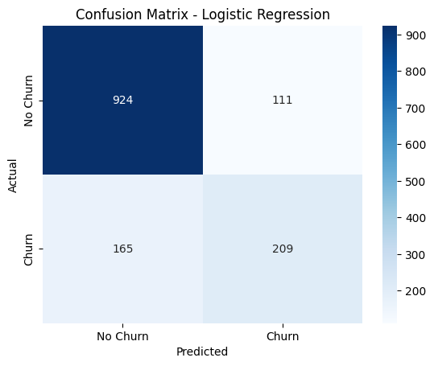
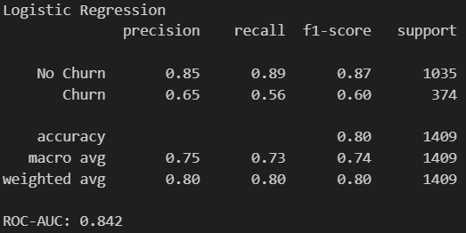
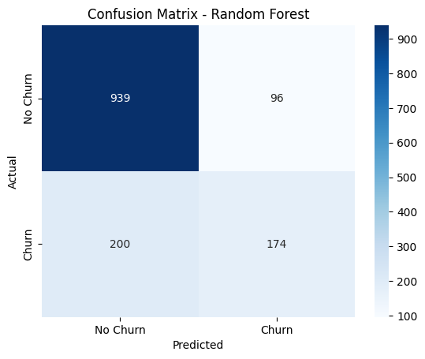
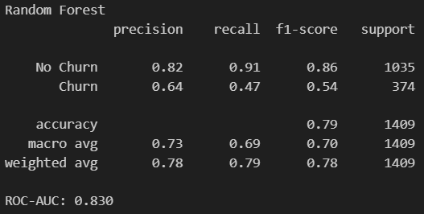
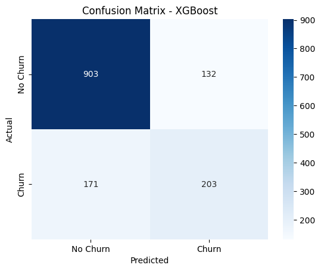
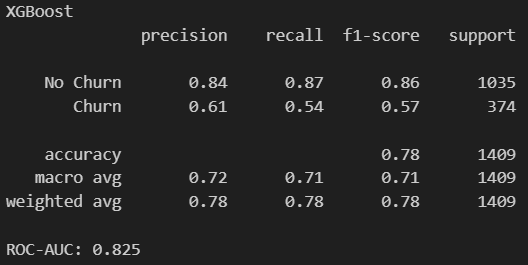

# Customer Churn Prediction

End-to-end machine learning project to predict customer churn using the Telco Customer Churn dataset.

---

## Project Overview
- Dataset: Telco Customer Churn (~7,000 records, 20+ features)
- Workflow:
  - Data loading and cleaning
  - Exploratory Data Analysis (EDA)
  - Feature engineering (encoding, scaling, handling missing values)
  - Model training: Logistic Regression, Random Forest, XGBoost
  - Model evaluation: Accuracy, Precision, Recall, F1, ROC-AUC
  - Explainability: Feature importance, SHAP values
  - Insights: identified drivers of churn such as short tenure, month-to-month contracts, and high monthly charges
  - Batch inference: automated script to score new customer data

---

## Project Structure
```
churn-prediction/
├─ data/                    # raw data (CSV)
├─ models/                  # saved pipeline & metadata 
├─ notebooks/               # EDA & experiments
├─ outputs/                 # predictions & reports
├─ src/
│ ├─ predict_batch.py       # batch inference script
│ └─ train.py               # retrain end-to-end
└─ app.py                   # Streamlit web app

```
---
## Setup
```powershell
git clone https://github.com/Mickjrp/churn-prediction.git
cd churn-prediction

python -m venv .venv
.\.venv\Scripts\Activate.ps1

pip install -r requirements.txt
```

## Training
```powershell
python src/train.py
```

Artifacts created:
- `models/churn_model.pkl` -> best pipeline model
- `models/model_meta.json` -> metadata (features, column types)
- `outputs/predictions.csv` -> predictions on test set

## Batch Inference
```powershell
python src/predict_batch.py --input data/new_customers.csv --output outputs/predict_new.csv
```

Output: `predict_new.csv` with `Churn_proba` and `Churn_pred`

---

## EDA Insight


Customers on **month-to-month contracts** churn at a much higher rate compared to those on one-year or two-year contracts (as shown in Churn by Contract Type).

---

## Model Results

### Logistic Regression
- **Accuracy:** 0.80  
- **ROC-AUC:** 0.842  
- **Strengths:** Good balance between precision (0.65) and recall (0.56) for churn. Best ROC-AUC among the three models.  
- **Weaknesses:** Tends to miss some churn cases (lower recall).  

<p align="left">
  
  
</p>

---

### Random Forest
- **Accuracy:** 0.79  
- **ROC-AUC:** 0.830  
- **Strengths:** Highest recall for **No Churn** (0.91). Strong performance in identifying customers who stay.  
- **Weaknesses:** Lowest recall for **Churn** (0.47), meaning it misses many churn cases.  

<p align="left">
  
  
</p>

---

### XGBoost
- **Accuracy:** 0.78  
- **ROC-AUC:** 0.825  
- **Strengths:** More balanced performance than Random Forest, with churn recall of 0.54 (better than Random Forest).  
- **Weaknesses:** Slightly lower overall accuracy compared to Logistic Regression.  

<p align="left">
  
  
</p>

---

## Model Insight
- Logistic Regression achieves the **best overall performance** with the highest ROC-AUC (0.842), making it most reliable for churn prediction.  
- Random Forest strongly identifies non-churn customers but struggles to detect churners.  
- XGBoost provides a balance between precision and recall but does not surpass Logistic Regression.  

**Conclusion:** Logistic Regression is the most suitable model for this dataset, especially when prioritizing a balance between correctly predicting churn and non-churn customers.


